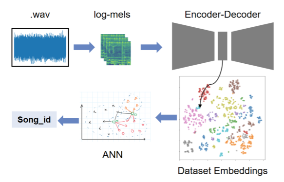

# Genre Classification and Song Fingerprinting



## How to clone
* ```git clone git@github.com:Joel103/genre_classification.git```
* Attention: Some submodules are large (most files are in Git LFS, see below in *Git LFS* how to work with it)
* ```git submodule update --init```
* ```git submodule update -r```

## How to prepare
* We suggest to use the ```docker_environment.sh```file and adapting it, whether you have a GPU or not
* Connect to the Jupyter interface of the container and login with the token printed by the container
* Open a terminal or run it a notebook with a _bash cell_ or export _ENV Variables_ within the code:
  * ```pip install -r requirements.txt```
  * ```export WANDB_PROJECT=<desired project>```
  * For local testing only please also use(is default):
    * ```export WANDB_MODE=dryrun```
  * For online tracking of the training use:
    * ```export WANDB_MODE=run```
  * For synced training(online) run in a terminal(you need an W&B account for this):
    * ```wandb login```

## How to execute
* Execute "Data_Preprocessing.ipynb" once (saves the dataset e.g. in /tmp/ folder)
* Execute "Training.ipynb" once per training (trains model and saves it into models/ folder)
* Execute "ANN_Inference.ipynb" once per trained model to evalute embedding and classify genres/songs (creates ANN/Plots/Metrics of a model)


## How to configure
* The data preparation and the model training is configured via the "config.json"
* You can also use command line arguments (also via W&B) and overwrite config settings during the execution
* Leave it as it is, to reproduce our results

## W&B alternative login for CI/CD (silent login):
* ```export WANDB_ENTITY=dl4aed```
* ```export WANDB_API_KEY=<your api key>```

## W&B extras:
* ```export WANDB_NOTEBOOK_NAME=Training```

## Open Add-Ons

1. Integrate classifier model into training loop. ✔️ 
2. Build Inference pipeline: embed -> song-recognition. ✔️ 
3. Inspect & maybe implement Transfer Learning (for spectrograms?). 🔜
4. Prepare slides. ✔️ 
5. Build ResNet-Model. ✔️ 
6. Test different dataset. ✔️
7. Extending scope lenght of each image (1 image should have longer temporal view than ~3 sec.). 🔜

## Git LFS
* Install it on your local system: https://www.atlassian.com/git/tutorials/git-lfs#installing-git-lfs
* If you don't want to download the LFS files use ```GIT_LFS_SKIP_SMUDGE=1``` right before your ```git clone``` or ```git submodule```
* If you want to fetch all of them later use in the command ```git lfs fetch --all``` _or_ just fetching specific folders or excluding a file: https://github.com/git-lfs/git-lfs/blob/main/docs/man/git-lfs-fetch.1.ronn#options
* To checkout the fetched files into your repo use ```git lfs checkout```
* Ignore errors like ```error: somefile: cannot add to the index - missing --add option?``` the file is still downloaded
* If you did something wrong, discard all changes ```git reset --hard```
